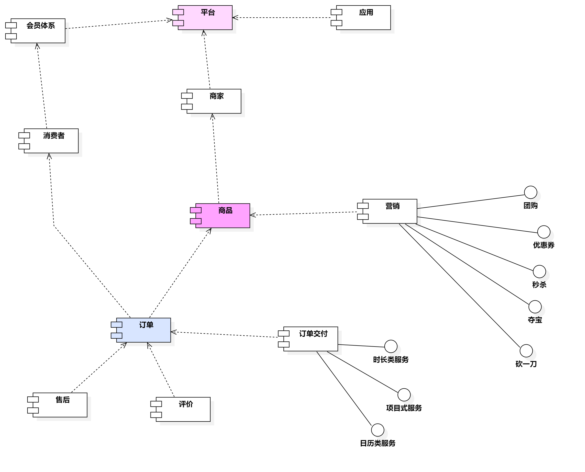
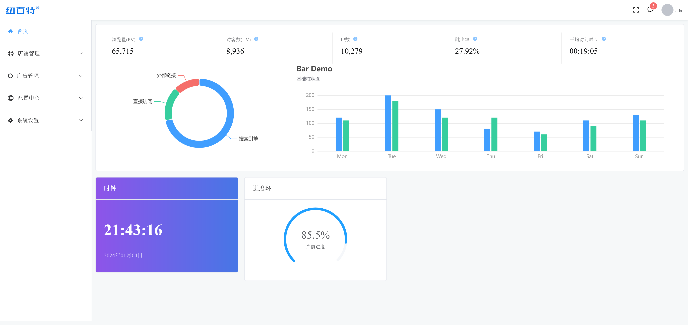
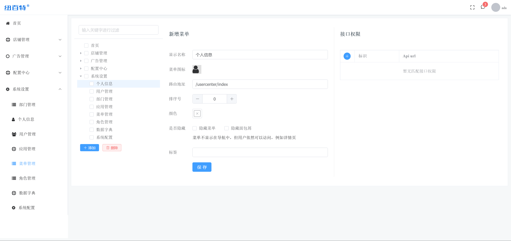
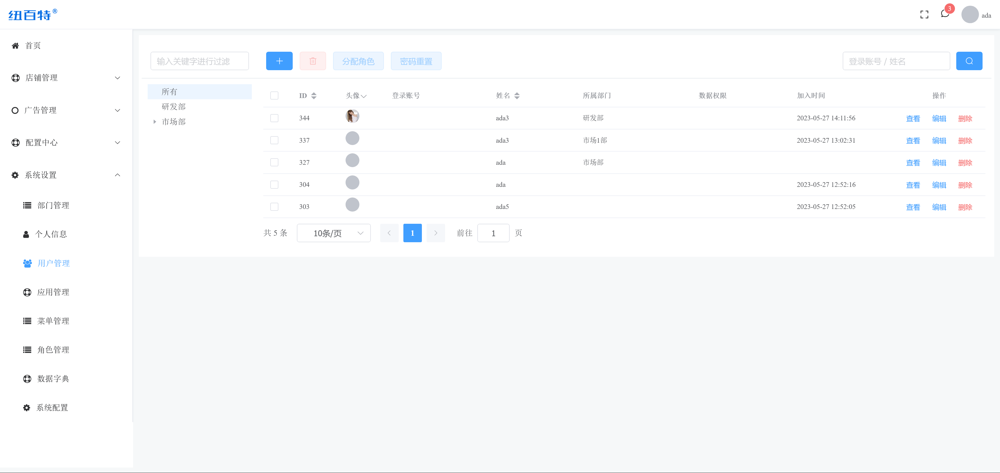

## 去好店
[](http://mvnrepository.com/artifact/com.nbsaas.boot/nbsaas-boot)
[](//shang.qq.com/wpa/qunwpa?idkey=d1a308945e4b2ff8aeb1711c2c7914342dae15e9ce7041e94756ab355430dc78)
[](https://www.jetbrains.com/idea/)
[](https://github.com/nbsaas/nbsaas-boot)

> 去好店，让你快速的找到喜欢的店铺。
## 最近项目正在进行重构，spring boot+nuxt3+vue3，前后端分离，请大家耐心等待



## 编码规范

### 1.项目结构规范

```
{主工程}
{主工程}.adapters
{主工程}.apis
{主工程}.apps
{主工程}.code-generator
{主工程}.commons
{主工程}.gates
{主工程}.gateway
{主工程}.resources

```

### 2.Api模块结构规范

```
com.{公司域名}.{主工程}.{子工程}
com.{公司域名}.{主工程}.{子工程}.api.apis
com.{公司域名}.{主工程}.{子工程}.api.domain.enums
com.{公司域名}.{主工程}.{子工程}.api.domain.request
com.{公司域名}.{主工程}.{子工程}.api.domain.response
com.{公司域名}.{主工程}.{子工程}.api.domain.simple
com.{公司域名}.{主工程}.{子工程}.ext.apis
com.{公司域名}.{主工程}.{子工程}.ext.domain.enums
com.{公司域名}.{主工程}.{子工程}.ext.domain.request
com.{公司域名}.{主工程}.{子工程}.ext.domain.response
com.{公司域名}.{主工程}.{子工程}.ext.domain.simple
```

### 3.Resource模块结构规范

```
com.{公司域名}.{主工程}.{子工程}
com.{公司域名}.{主工程}.{子工程}.data.entity
com.{公司域名}.{主工程}.{子工程}.data.repository
com.{公司域名}.{主工程}.{子工程}.data.mapper
com.{公司域名}.{主工程}.{子工程}.rest.conver
com.{公司域名}.{主工程}.{子工程}.rest.resource
com.{公司域名}.{主工程}.{子工程}.ext.conver
com.{公司域名}.{主工程}.{子工程}.ext.resource
```

### vue视图结构

```
/views/业务模块/add.vue
/views/业务模块/component_组件业务1.vue
/views/业务模块/component_组件业务2.vue
/views/业务模块/component_组件业务n.vue
/views/业务模块/index.vue
/views/业务模块/update.vue
/views/业务模块/view.vue
/views/业务模块/view_layout.vue
/views/业务模块/view_业务1.vue
/views/业务模块/view_业务2.vue
/views/业务模块/view_业务n.vue

```

### 技术选型：

#### 服务端
* Spring、SpringMVC、spring data jpa、mybatis
* Spring boot,Spring cloud,[spring-cloud-tencent](https://gitee.com/Tencent/spring-cloud-tencent) 
* 安全权限 Shiro
* 缓存 caffeine
* 代码生成模板 freemarker
* 其它 Jsoup、gson
* 核心采用Request-Response模式，Chain模型。
* [nbsaas-boot](https://gitee.com/cng1985/nbsaas-boot)

#### [pc端](https://gitee.com/cng1985/nbsaas-life-nuxt3)
* nuxt3
* element-plus


#### 后台管理端

* vue3
* element-plus
* axios
* [nuxt3前端](https://gitee.com/cng1985/nbsaas-life-nuxt3)
* [vue3管理端](https://gitee.com/cng1985/nbsaas-life-admin)
## 后台演示环境
[http://mall2.nbsaas.com](http://mall2.nbsaas.com)
账号 ada 密码123456
##  后台部分效果图




## 搭建步骤

1. 创建数据库。如使用MySQL，字符集选择为`utf8`或者`utf8mb4`（支持更多特殊字符，推荐）。
2. 在idea中导入maven项目。点击idea菜单`File` - `open`，选择 `项目所在磁盘位置`。创建好maven项目后，会开始从maven服务器下载第三方jar包（如spring等），需要一定时间，请耐心等待。
3. 创建mysql数据库，导入`/documents/sql/nbsaas-mall2.sql`
4. 修改数据库连接。打开`/gates/admin/main/resources/application.yml`文件，根据实际情况修改`jdbc.url`、`jdbc.username`、`jdbc.password`的值。
5. 运行程序AdminApplication(后台)，FrontApplication(前台)
6. 下载vue3后台管理端[https://gitee.com/cng1985/nbsaas-life-admin](https://gitee.com/cng1985/nbsaas-life-admin
7. 访问系统。前台接口地址：[http://localhost:8081](http://localhost:8081/)，后台接口地址：[http://127.0.0.1:8082/](http://127.0.0.1:8082/)；用户名：ada，密码：123456。

